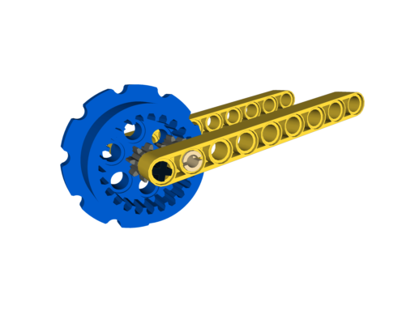

This is a simple Python script for converting a 3D printing [.stl](https://en.wikipedia.org/wiki/STL_%28file_format%29)
file to a LDraw format [.dat](http://www.ldraw.org/article/218) file. Then you can use the part just like any other part in
your favorite LDraw viewer or CAD program.

Usage:

```
> python stlToDat.py input_file.stl output_file.dat
```

If the output file is not specified the input file name will be used with a .dat extension.

The STL file needs to be in millimeters.
